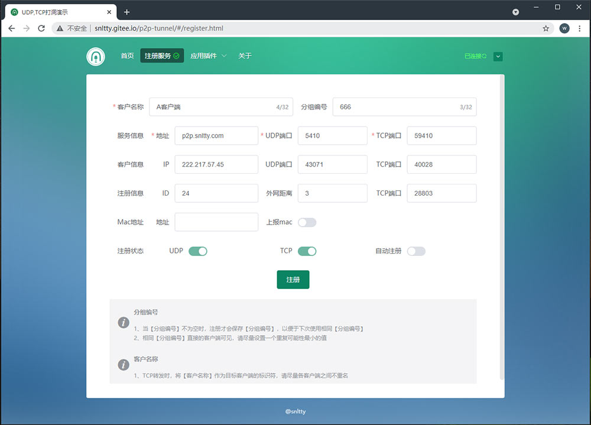
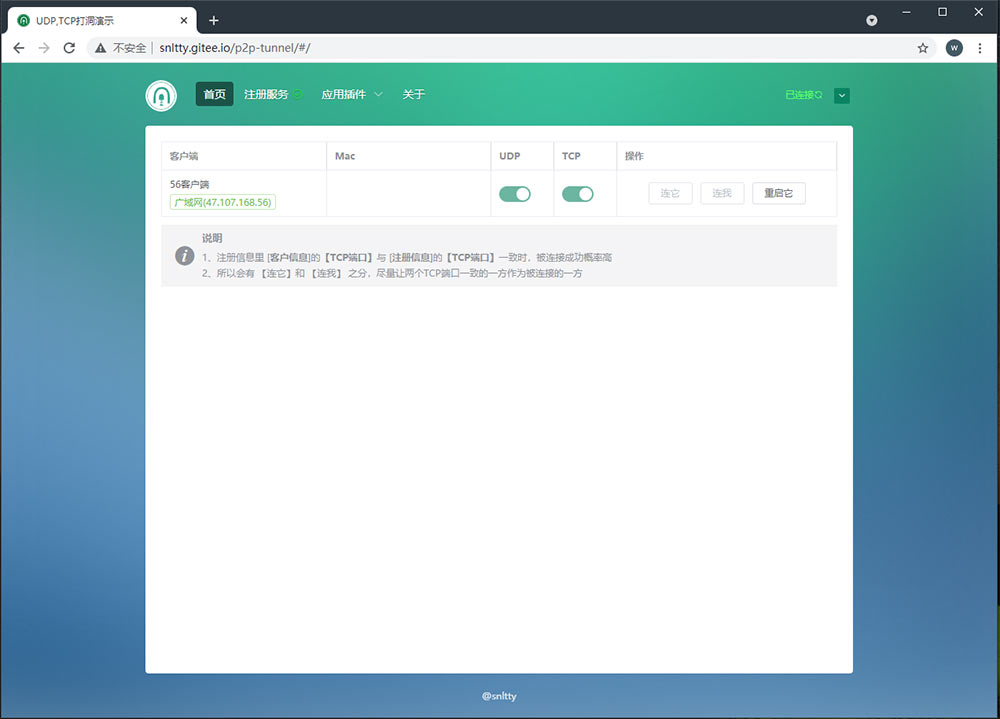
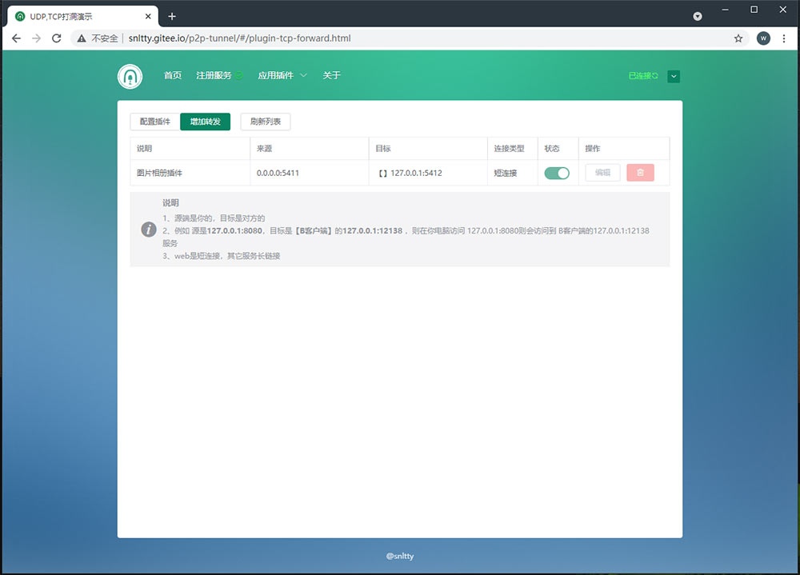
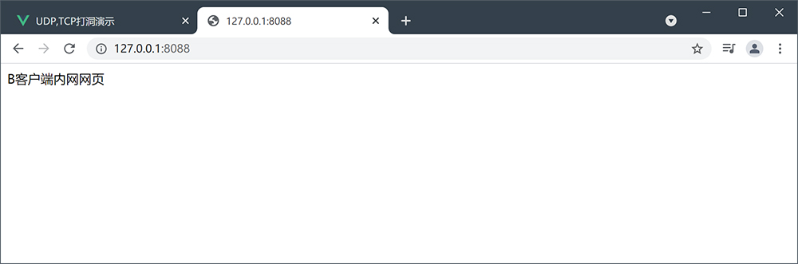
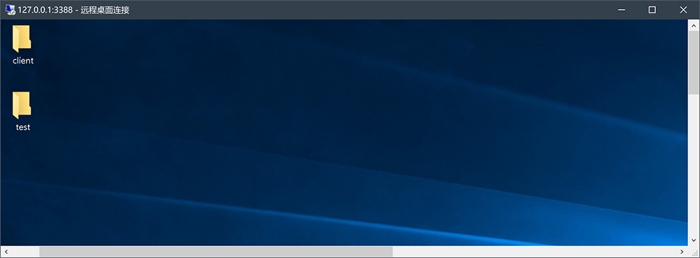
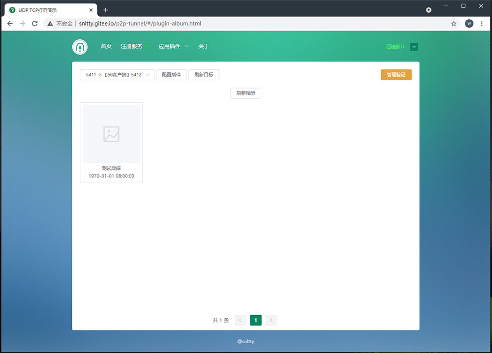
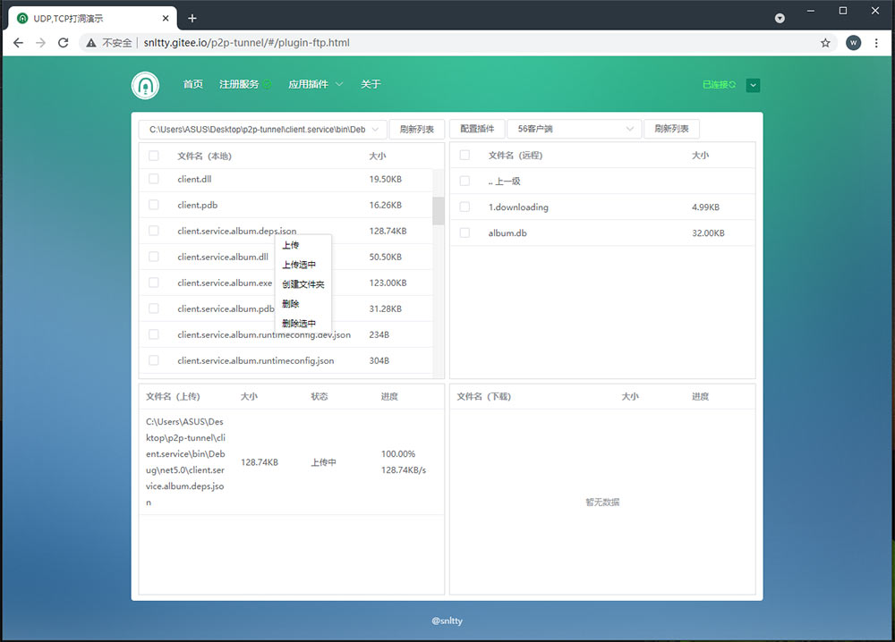

<!--
 * @Author: snltty
 * @Date: 2021-08-22 14:09:03
 * @LastEditors: snltty
 * @LastEditTime: 2021-09-29 16:48:14
 * @version: v1.0.0
 * @Descripttion: 功能说明
 * @FilePath: \client.web.vue3c:\Users\ASUS\Desktop\p2p-tunnel\README.md
-->
# 详细说明

<a href="http://snltty.gitee.io/p2p-tunnel/#/about-home.html" target="_blank">详细说明</a>

# p2p-tunnel

1. .NET5 Socket编程实现内网穿透
2. UDP,TCP打洞实现点对点直连
3. 访问内网web，内网桌面，及其它TCP上层协议服务
4. 服务端只承受 客户端注册，客户端信息的交换。不承受数据转发，几乎无压力

### 项目结构
1. p2p  打洞项目
    1. client 客户端公共内容
    2. client.service 客户端服务
    3. client.service.album 客户端服务的 图片相册插件
    4. client.service.ftp 客户端服务的  文件服务插件
    5. client.service.tcpforward 客户端服务的 tcp转发插件
    6. common 一些公共的功能
    7. server 服务器
    8. server.service 打洞服务器的服务端
2. platform 跟平台有关的一些实验项目
    1. win  windows特有的
        1. remoteDektop 远程桌面相关
            1. mstsc.manager 远程桌面管理
            2. rdp.desktop rdp协议的桌面共享
            3. rdp.viewer rdp协议的桌面共享查看器
3. testing  尝试中的项目
    1. audio.test 音频测试
    2. NSpeex 音频压缩
    3. ozeki 降噪 回音消除
    4. mstsc.manager windows远程桌面管理
    5. rdp.desktop rdp 桌面共享 
    6. rdp.viewer  rdp 桌面共享查看器
4. client.web.vue3 客户端管理界面

### 截图
#### 1. 注册

#### 2. 客户端列表

#### 3. 转发配置

1. TCP转发 - 访问对方网页

    

2. TCP转发 - 访问对方桌面

    

#### 4. 图片相册

#### 5. 文件服务

#### 6. 持续丰富中...